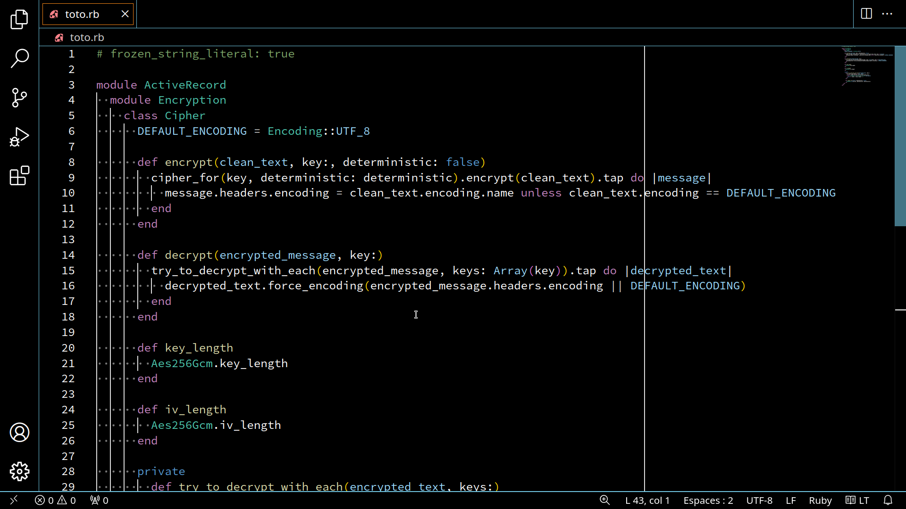
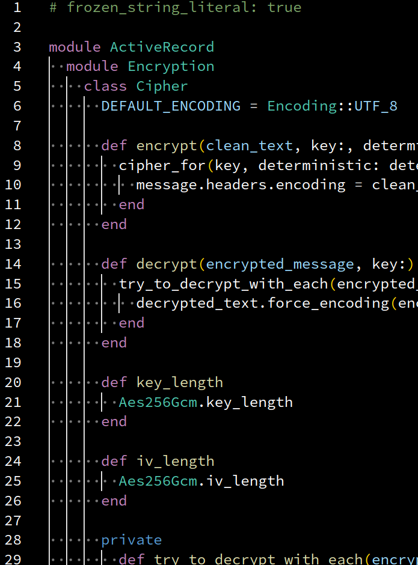
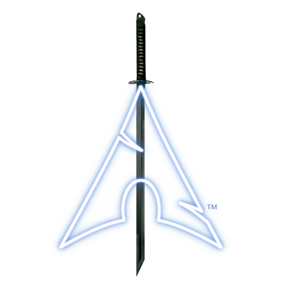
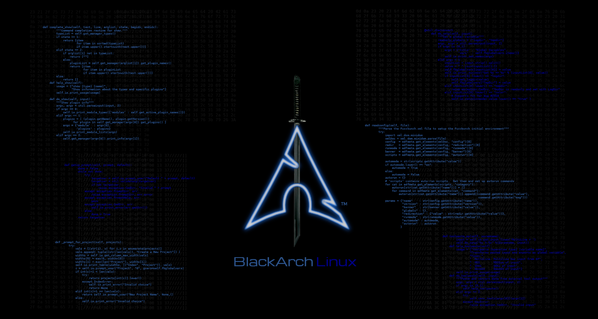
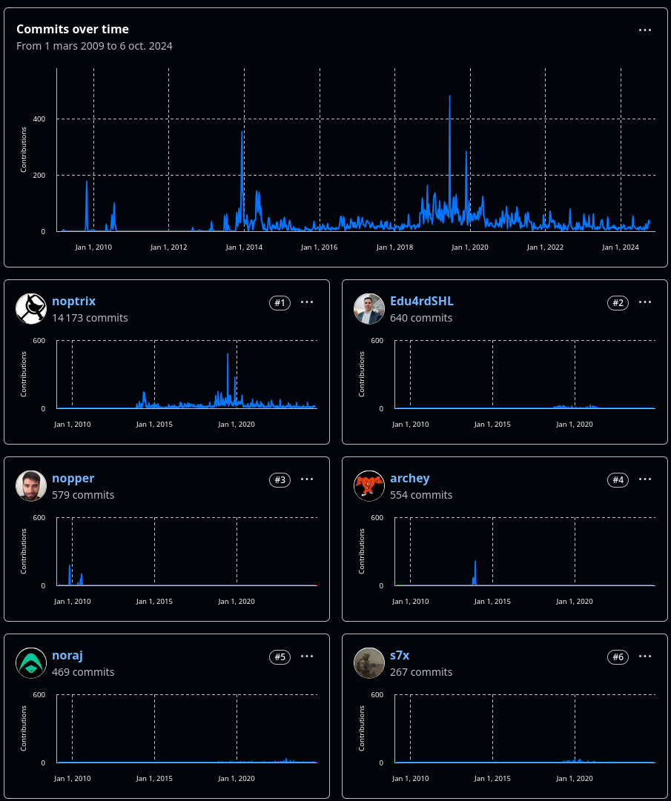
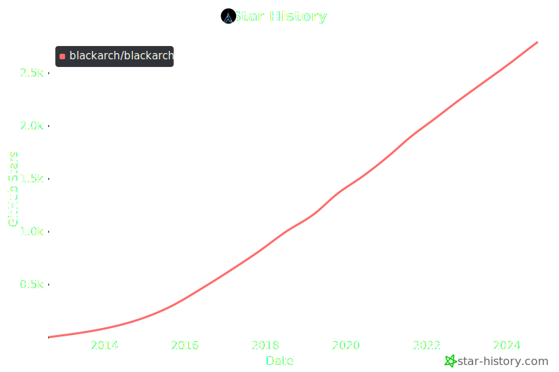
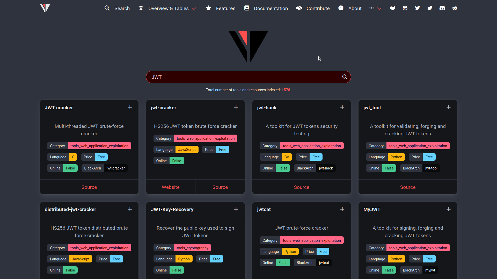
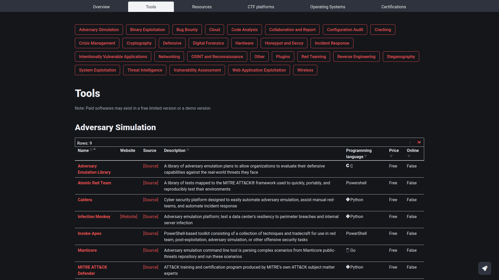
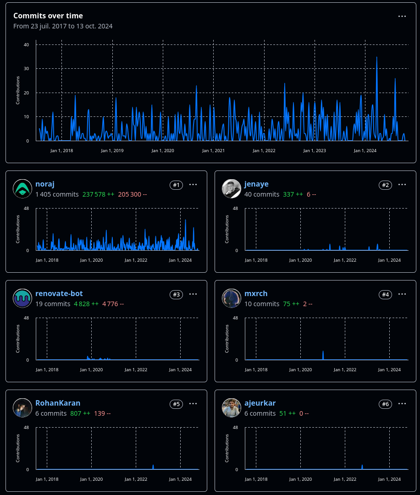
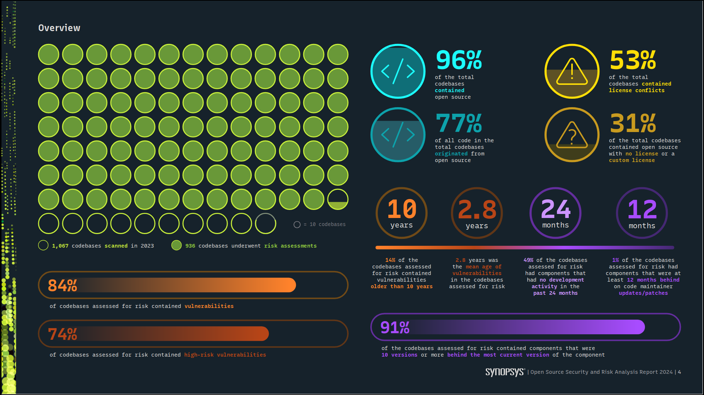

<!-- _header: '' -->
<!-- _footer: '' -->

## Open Source Immersion 2024
### Logiciel libre & Cybersécurité



---

## Présentation - Activités

- Alexandre ZANNI (@noraj)
- Ingénieur en test d'intrusion
- Recherche et développement
- Contributeur logiciel libre
- Mainteneur BlackArch Linux


---

## Présentation - GitHub

- depuis 2016
- 6 k étoiles reçues
- 1.8 k abonnés
- 13k+ commits
- 1.6k+ PRs
- 1.9k issues
- contributions + 100anines projets


---

## Plan

1. BlackArch
2. Rawsec Cybersecurity Inventory
3. Anecdotes et écosystème
4. Synacktiv : recherche et développement

---



## BlackArch

---




Distribution GNU/Linux en source ouverte pensée pour le test d'intrusion et plus généralement pour la cybersécurité technique. Basée sur ArchLinux.


---

<!-- _header: '' -->
<!-- _footer: '' -->



2920 outils (08/10/2024)
vs ~ 600 pour Kali Linux

---


---

<!-- _header: '' -->
<!-- _footer: '' -->

2009-2024



---

#### Installation

- ISO : Full (22 GO), Slim (5.5 Go), NetInstall (815 Mo)
- VM : OVA (29 Go)
- par-dessus ArchLinux comme dépôt additionnel
- HTTP, HTTPS, FTP, rsync, torrent
- miroirs : 🇦🇺🇦🇹🇨🇦🇨🇳🇩🇰🇪🇨🇫🇷🇩🇪🇬🇷🇬🇧🇭🇺🇮🇳🇮🇷🇮🇹🇯🇵🇰🇷🇲🇩🇳🇱🇳🇿🇵🇱🇵🇹🇷🇺🇸🇬🇸🇪🇨🇭🇹🇷🇹🇼🇺🇸

---

<!-- _header: '' -->
<!-- _footer: '' -->

#### Statistiques



- 562 fourches (_forks_)
- 2,8k étoiles (_stars_)
- 99 contributeurs
- 4-5 membres actifs
- 24313 archivages (_commits_)
- 1635 fusiodemandes (_merge requests_)
- 2535 tickets (_issues_)

---

###### PKGBUILD

```bash
# This file is part of BlackArch Linux ( https://www.blackarch.org/ ).
# See COPYING for license details.

pkgname=ffuf
pkgver=v2.1.0.r3.gde9ac86
pkgrel=1
epoch=1
groups=('blackarch' 'blackarch-webapp' 'blackarch-fuzzer')
pkgdesc='Fast web fuzzer written in Go.'
arch=('x86_64' 'aarch64')
url='https://github.com/ffuf/ffuf'
license=('MIT')
makedepends=('git' 'go')
options=('!strip')
source=("git+https://github.com/ffuf/$pkgname.git")
sha512sums=('SKIP')
```

---

```bash
pkgver() {
  cd $pkgname

  git describe --long --tags | sed 's/\([^-]*-g\)/r\1/;s/-/./g'
}

build() {
  cd $pkgname

  GOPATH="$srcdir" go mod download
  GOPATH="$srcdir" go build \
    -trimpath \
    -buildmode=pie \
    -mod=readonly \
    -modcacherw \
    -ldflags "-s -w" \
    -o $pkgname .
}

package() {
  cd $pkgname

  install -Dm 755 $pkgname "$pkgdir/usr/bin/$pkgname"
  install -Dm 644 "${pkgname}rc.example" \
    "$pkgdir/usr/share/$pkgname/${pkgname}rc.example"
  install -Dm 644 -t "$pkgdir/usr/share/doc/$pkgname/" *.md
}
```

---

#### Le travail d'un mainteneur

- Empaqueter des nouveaux outils
- Corriger les bogues / améliorer
- MAJ les outils
- MAJ / ajouter des modèles de PKGBUILD
- Autres : ISO, torrents, support à la communauté Reddit / Matrix / GitHub / courriel, ajout miroirs de dépôts
- Site web, outils comme wordlistctl, webshells

---


## Rawsec Cybersecurity Inventory

---


Un inventaire d'outils et de ressources sur la cybersécurité qui vise à aider les gens à trouver tout ce qui est lié à la cybersécurité.

---

<!-- _header: '' -->
<!-- _footer: '' -->



---

<!-- _header: '' -->
<!-- _footer: '' -->



---

#### Statistiques



- depuis 2017
- 41 contributeurs
- 1948 archivages (_commits_)
- 1578 outils et ressources répertoriés

---


[youtu.be/9rzxX0TFT88](https://youtu.be/9rzxX0TFT88)


---


## Anecdotes et écosystème

---

###### Choix de projets / dépendances (1/2)

- Critères de choix communs
  - âge, étoiles, activité, esthétisme
- Critères de choix négligés
  - documentation, qualité du code, tests, posture de sécurité, métriques de qualité
- Qualité vs esthétisme
  - logo + captures d'écrans + emoji README.md + 200 tweets vs pas de logo, pas de médiatisation, SECURITY.md, code de qualité et tests CI/CD

---

###### Choix de projets / dépendances (2/2)

- Études des critères au départ vs durant la vie du projet
- Dépendance énorme pour 1 fonction de 3 lignes
- Dépendances transitives (sous-dépendances)

➡️ Nomenclature logicielle (_Software Bill of Materials_, SBOM) : intégrité, visibilité, identifier les vulns.

---

###### Projets sous-soutenus

- Règle du 1/10/100 voir 1/10/1000
- Beaucoup de projets importants reposent sur peu de personnes
- Beaucoup de gros projets reposent sur ces précédents
- Beaucoup d'entreprises ou produits commerciaux les utilisent sans contribuer (code, dons)

---

###### Projets sous-soutenus (exemples, 1/2)

- BlackArch, une poignée de devs.
- Let's Encrypt, 2-3 personnes et 1 serveur au début
- NTP, [principalement][ntp-contribs] [1 personne][ntp-main] (Harlan Stenn)
- GPG, [principalement][gpg-contribs] [1 personne][gpg-main] (Werner Koch)

[ntp-contribs]:https://www.ntp.org/contributorslist/
[ntp-main]:https://www.informationweek.com/it-leadership/ntp-s-fate-hinges-on-father-time-
[gpg-contribs]:https://gnupg.org/people/index.html
[gpg-main]:https://www.propublica.org/article/the-worlds-email-encryption-software-relies-on-one-guy-who-is-going-broke

---

###### Projets sous-soutenus (exemples, 2/2)

- Bash, [1 personne][bash-main] (Chet Ramey)
- BDD des zones de temps, [2 personnes][TZdb-main]
- SQLite, [3 personnes][sqlite-main]

[bash-main]:https://git.savannah.gnu.org/cgit/bash.git/log/
[TZdb-main]:https://mm.icann.org/pipermail/tz/2011-October/008093.html
[sqlite-main]:https://www.sqlite.org/crew.html


---

###### Projets sous-soutenus (anecdotes - OpenSSL)

OpenSSL, [principalement][openssl-contribs] [2 personnes][openssl-main]. Après Heartbleed (2014), le gouvernement des EUA a mis la pression aux devs. et leur a demandé de travailler pendant leurs vacances pour corriger le problème en urgence.
2000 $ / an de don avant.

[openssl-contribs]:https://openssl-library.org/about/committers/index.html
[openssl-main]:https://www.buzzfeed.com/chrisstokelwalker/the-internet-is-being-protected-by-two-guys-named-st

---

###### Projets sous-soutenus (anecdotes - left-pad)

En 2016, Azer Koçulu a dépublier plus de 250 de ses dépendances d'NPM.
En particulier, une des dépendances, [left-pad][left-pad-github] (rajoute des `0` ou des espaces sur la gauche d'une chaîne de caractère), était utilisé par node.js, Babel et des milliers d'autres projets. Le château de carte s'est donc écroulé lorsque ces projets essayaient d'installer leurs dépendances.

[left-pad-github]:https://github.com/azer/left-pad/blob/master/index.js

---

###### Projets sous-soutenus (anecdotes - left-pad)

left-pad était téléchargé 2,5m fois / mois et ne contenait que 11 lignes de codes.

Sources [[1]][left-pad-theregister], [[2]][left-pad-qz]

[left-pad-theregister]:https://www.theregister.com/2016/03/23/npm_left_pad_chaos/
[left-pad-qz]:https://qz.com/646467/how-one-programmer-broke-the-internet-by-deleting-a-tiny-piece-of-code

---

###### Projets sous-soutenus (anecdotes - xz)

Après la commotion causé par la porte dérobée dans `xz`, [Microsoft a demandé][xz-ffmepg-microsoft] au mainteneurs de FFmpeg de les aider en urgence car utilisé dans un produit Microsoft très populaire.

[xz-ffmepg-microsoft]:https://threadreaderapp.com/thread/1775178803129602500.html

---

###### Projets sous-soutenus (anecdotes - xz)

> Le fiasco de xz a montré comment la dépendance à l'égard de volontaires non rémunérés peut entraîner des problèmes majeurs. Les entreprises qui brassent des milliards de dollars s'attendent à recevoir un soutien gratuit et urgent de la part des bénévoles.

Microsoft avait suggéré pour donner quelques milliers de $ mais n'a finalement jamais souscrit à un contrat de support.

---

###### Projets sous-soutenus (anecdotes - core-js)

core-js permet d'intégrer de nouvelles fonctionnalités JavaScript dans les anciens navigateurs. Des tonnes de bibliothèques populaires telles que Babel s'appuient dessus. En 2020, 75 % des 100 sites web les plus populaires l'utilisaient. Il a renversé un piéton et est allé en prison 18 mois. Il n'avait pas de quoi payer la caution, car il avait quitté son travail pour maintenir core-js à temps plein et était sans revenu.
_[Source](https://github.com/zloirock/core-js/blob/master/docs/2023-02-14-so-whats-next.md)_

---

> Plus de 50 % des projets n'ont pas permis à leurs responsables de vivre au-dessus du seuil de pauvreté, tandis que 31 % ont généré suffisamment d'argent pour un salaire considéré comme inacceptable dans le secteur.
>
> _André Staltz, 2019, données de l'Open Collective and GitHub_

---

###### Projets sous-soutenus (conclusion)

Les infrastructures critiques et la sécurité de nombreuses entreprises reposent sur la bonne volonté d'un bénévole seul qui travaille sur son temps libre.

Mais combien ?

---

> Le nombre de composants open-source par application commerciale est passé de **84 en 2016** à **528 en 2020**.
>
> _Synopsy, Open Source Security & Risk Analysis Report 2021_


---

Quelques statistiques de

[_Synopsys, Open Source Security and Risk Analysis Report 2024_](https://www.synopsys.com/content/dam/synopsys/sig-assets/reports/rep-ossra-2024.pdf)

---

<!-- _header: '' -->
<!-- _footer: '' -->



---


## Synacktiv : recherche et développement

---


- Test d'intrusion / Red Team
- Réponse aux incidents
- Formations
- Reverse-engineering
- Développement

---

## Confusion de dépendances

---

###### Synacktiv - R&D - Confusion de dépendances - Liens

📰 [Fuzzing confused dependencies with Depfuzzer](https://www.synacktiv.com/publications/fuzzing-confused-dependencies-with-depfuzzer)

🧰 https://github.com/synacktiv/DepFuzzer

---

###### Synacktiv - R&D - Confusion de dépendances - Alternatives

Exemples d'attaques sur les dépendances :

- typosquattage de nom de paquets populaires
- compromission de paquets existants
- prise de contrôle de nom de paquets disparus
- 🔍 **prise de contrôle de nom de paquets privés**

---

###### Synacktiv - R&D - Confusion de dépendances - Concept

Publier sur un registre de paquets public un logiciel malveillant portant le même nom qu'un paquet privé afin qu'il soit installer à sa place par priorisation des registres.

💡 Moyen très effectif de rentrer dans le réseau privé d'une grande organisation.

---

###### Synacktiv - R&D - Confusion de dépendances - Entreprises impactées

Le chercheur Alex Birsan a pu exécuter du code chez Shopify, Apple, PayPal, Netflix, Yelp, Uber.

---

###### Synacktiv - R&D - Confusion de dépendances - Cause - pip

🐍 `--extra-index-url` pour `pip install`

- Vérifie si la bibliothèque existe sur le registre de paquets interne spécifié
- Vérifie si la bibliothèque existe sur le registre public (PyPI)
- Installe la version trouvée, mais si le paquetage existe sur les deux, l'installe depuis la source ayant le n° de version le plus élevé

---

###### Synacktiv - R&D - Confusion de dépendances - Remédiation - pip

Publication d'un paquet en version `9999.0.0`.

🩹 `--index-url` plutôt que `--extra-index-url`.

---

###### Synacktiv - R&D - Confusion de dépendances - Cause - gem

Peut-être `--source` pour `gem install`. Potentiellement le même comportement que pour `pip`.

---

###### Synacktiv - R&D - Confusion de dépendances - Artifactory

[JFrog Artifactory][artifactory] est gestionnaire de registre universel. Une de ses fonctionnalités est de mélanger les paquets publics et privés dans un registre virtuel.

Même comportement que pour `pip`. Pareil pour Azure Artifacts.

Impossible à changer pour l'utilisateur.

[artifactory]:https://jfrog.com/artifactory/

---

###### Synacktiv - R&D - Confusion de dépendances - Cause - npm

Ordre de résolution `npm install` :

- Local
- Serveur HTTP externe
- Github
- Registre npm

---

###### Synacktiv - R&D - Confusion de dépendances - Cause - npm

`.npmrc` pour ↔️ entre paquet et registre

Problème :

- `.npmrc` manquant (ex : `.gitignore`)
- `.npmrc` mal configuré

---

###### Synacktiv - R&D - Confusion de dépendances - DepFuzzer

Vérifie sur [deps.dev](https://deps.dev/) (Google OSS) si les dépendances existent.

Support : npm, pypi, cargo, go

---

## GitHub Action

---

###### Synacktiv - R&D - GitHub Action - Série d'articles

Série _GitHub Actions exploitation_ sur la CI/CD GitHub : GitHub Action.

- [N°1 - Introduction][github-action-1]
- [N°2 - Untrusted input][github-action-2]
- [N°3 - Repo jacking and environment manipulation][github-action-3]
- [N°4 - Self hosted runners][github-action-4]
- [N°5 - Dependabot][github-action-5]
- [Hors série - Hijacking GitHub runners to compromise the organization][github-action-hs]

[github-action-1]:https://www.synacktiv.com/en/publications/github-actions-exploitation-introduction
[github-action-2]:https://www.synacktiv.com/publications/github-actions-exploitation-untrusted-input
[github-action-3]:https://www.synacktiv.com/publications/github-actions-exploitation-repo-jacking-and-environment-manipulation
[github-action-4]:https://www.synacktiv.com/publications/github-actions-exploitation-self-hosted-runners
[github-action-5]:https://www.synacktiv.com/publications/github-actions-exploitation-dependabot
[github-action-hs]:https://www.synacktiv.com/publications/hijacking-github-runners-to-compromise-the-organization

---

###### Synacktiv - R&D - GitHub Action - Résumé

Fonctionnement de GitHub Action, détails d'erreurs de configuration critiques, revue des pièges et des vulnérabilités habituels et comment développeurs peuvent s'en prémunir.

---

###### Synacktiv - R&D - GitHub Action - Projets vulnérables identifiés

CI/CD vulnérables identifiés dans les projets de : [AutoGPT][AutoGPT], [microsoft/generative-ai-for-beginners][ms-ai], [ant-design][ant-design], [cypress][cypress], [excalidraw][excalidraw], [Apache Doris][apache-doris], [FreeRDP][FreeRDP], [Angular][Angular], [swagger-editor][swagger-editor], [Azure Bicep][Azure Bicep], [Alibaba Nacos][Alibaba Nacos], [Homebrew][Homebrew], [Spring Security][Spring Security], [Akash node][Akash node], [WasmEdge][WasmEdge], [Lovell Sharp][Lovell Sharp], [haskell-language-server][haskell-language-server], [Scroll zkEVM circuits][scroll-tech/zkevm-circuits], [tRPC][tRPC]

[AutoGPT]:https://github.com/Significant-Gravitas/AutoGPT
[ms-ai]:https://github.com/microsoft/generative-ai-for-beginners
[ant-design]:https://github.com/ant-design/ant-design
[cypress]:https://github.com/cypress-io/cypress
[excalidraw]:https://github.com/excalidraw/excalidraw
[apache-doris]:https://github.com/apache/doris
[FreeRDP]:https://github.com/FreeRDP/FreeRDP
[Angular]:https://github.com/angular/angular
[swagger-editor]:https://github.com/swagger-api/swagger-editor
[Azure Bicep]:https://github.com/Azure/bicep-registry-modules
[Alibaba Nacos]:https://github.com/alibaba/nacos
[Akash node]:https://github.com/akash-network/node
[WasmEdge]:https://github.com/WasmEdge/WasmEdge
[Lovell Sharp]:https://github.com/lovell/sharp
[haskell-language-server]:https://github.com/haskell/haskell-language-server/
[scroll-tech/zkevm-circuits]:https://github.com/scroll-tech/zkevm-circuits
[Homebrew]:https://github.com/Homebrew/brew
[Spring Security]:https://github.com/spring-projects/spring-security
[tRPC]:https://github.com/trpc/trpc

---

###### Synacktiv - R&D - GitHub Action - Outils

- 🔵 [synacktiv/octoscan][octoscan] - Scanneur de vulnérabilité pour les fichiers GitHub Action
- 🔴 [synacktiv/gh-hijack-runner][gh-hijack-runner] - Créé un faux runner GitHub et détourne des tâches de pipeline pour divulguer des secrets CI/CD

[octoscan]:https://github.com/synacktiv/octoscan
[gh-hijack-runner]:https://github.com/synacktiv/gh-hijack-runner

---

## Extraction de secrets CI/CD

---

###### Synacktiv - R&D - Extraction de secrets CI/CD - ⚠️

https://www.synacktiv.com/publications/cicd-secrets-extraction-tips-and-tricks
https://github.com/synacktiv/nord-stream

---

## Symfony

---

###### Synacktiv - R&D - Symfony - ⚠️

https://www.synacktiv.com/publications/looting-symfony-with-eos.html
https://github.com/synacktiv/eos

---

## Merci pour votre attention

⚠️ QR code téléchargement PDF

---


## Bonus : Pour aller plus loin

---

Série _La sécurité de la chaîne logicielle_ par _Merlin TCHOFFO_.

- [N°1 - Introduction - Menaces d'origine cyber][chaine-n1]
- [N°2 - Exemple d'attaque][chaine-n2]
- [N°3 - Shift left & DevSecOps][chaine-n3]
- ⭐[N°4 - SBOM/VEX][chaine-n4]
- ⭐[Hors-série n°1 : Rétrospective des échecs de la sécurité de la chaîne logicielle][chaine-hsn1]

[chaine-n1]:https://www.linkedin.com/pulse/la-s%25C3%25A9curit%25C3%25A9-de-cha%25C3%25AEne-logicielle-article-n1-ao%25C3%25BBt-2024-tchoffo-5ayee/
[chaine-n2]:https://www.linkedin.com/pulse/la-s%25C3%25A9curit%25C3%25A9-de-cha%25C3%25AEne-logicielle-partie-n2-ao%25C3%25BBt-2024-merlin-tchoffo-0bbye/
[chaine-n3]:https://www.linkedin.com/pulse/la-s%25C3%25A9curit%25C3%25A9-dans-cha%25C3%25AEne-logicielle-devsecops-partie-merlin-tchoffo-j2ete/
[chaine-n4]:https://www.linkedin.com/pulse/la-s%25C3%25A9curit%25C3%25A9-dans-cha%25C3%25AEne-logicielle-sbomvex-partie-n4-merlin-tchoffo-g5roe/
[chaine-hsn1]:https://www.linkedin.com/pulse/la-s%25C3%25A9curit%25C3%25A9-de-cha%25C3%25AEne-logicielle-partie-n3-ao%25C3%25BBt-2024-merlin-tchoffo-q7j2e/
